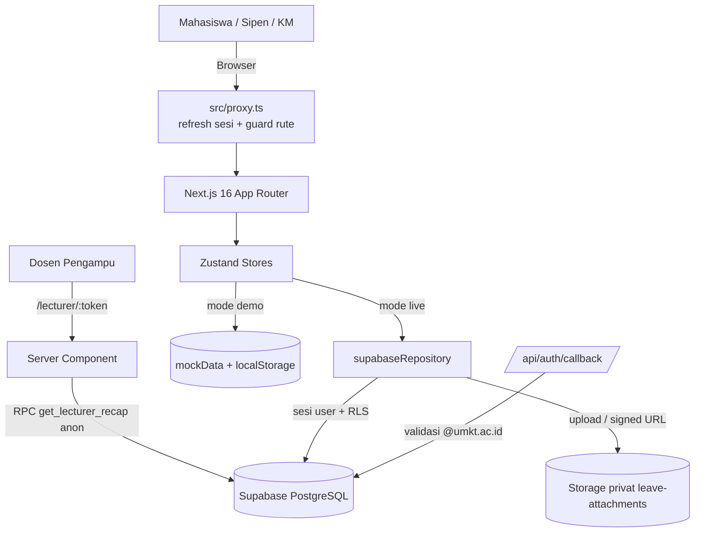

# SIPPER-TI: Arsitektur Sistem & Data

## 1. Ikhtisar Arsitektur
SIPPER-TI dirancang dengan arsitektur modern Next.js 16 App Router (Turbopack) yang mengutamakan performa, aksesibilitas, dan diferensiasi pengalaman pengguna pada desktop maupun mobile.

### Lapisan Keamanan

1. **Database (sumber kebenaran):** RLS + trigger di `supabase/migrations/20260927_security_hardening.sql`, diuji `supabase/tests/rls_test.sql`.
2. **Server:** `src/proxy.ts` (login & role untuk `/approval`, `/admin`), `/api/auth/callback` (domain kampus).
3. **Klien (UX):** `src/lib/permissions.ts` + `<RequireRole>` menyembunyikan aksi yang pasti ditolak server.

### Mode Demo vs Live

`src/lib/supabase/config.ts#isSupabaseConfigured()` menentukan mode saat build. Store (`useAuthStore`, `useLeaveStore`) bercabang ke mock atau `supabaseRepository`, sehingga komponen UI tidak perlu tahu sumber data.

## 2. Model Data & Peran Pengguna
Sistem membedakan 4 entitas peran:
1. **Mahasiswa:** Mengajukan izin pribadi, melampirkan berkas bukti, dan memantau status persetujuan.
2. **Sipen (Sie Pendidikan):** Mahasiswa penanggung jawab kelas yang memvalidasi berkas dan dapat mengajukan izin proxy.
3. **KM (Ketua Kelas):** Supervisor seluruh perizinan, mengelola token link dosen, dan memverifikasi izin.
4. **Dosen Pengampu:** Melihat rekapitulasi kehadiran secara real-time via token URL tanpa memerlukan autentikasi.

## 3. Skema Data Kunci
- `profiles`: `id, email, full_name, nim, role, avatar_url`
- `courses`: `id, code, name, lecturer_name, day_of_week, start_time, end_time, room, semester`
- `leave_requests`: `id, student_id, course_id, leave_type, start_date, end_date, reason, file_urls, status, rejection_reason, created_by, verified_by, verified_at`
- `lecturer_tokens`: `id, token, course_id, label, expires_at, revoked_at, created_by`
- `course_sipen`: pemetaan Sipen ↔ mata kuliah yang dikelola (dasar hak verifikasi)
